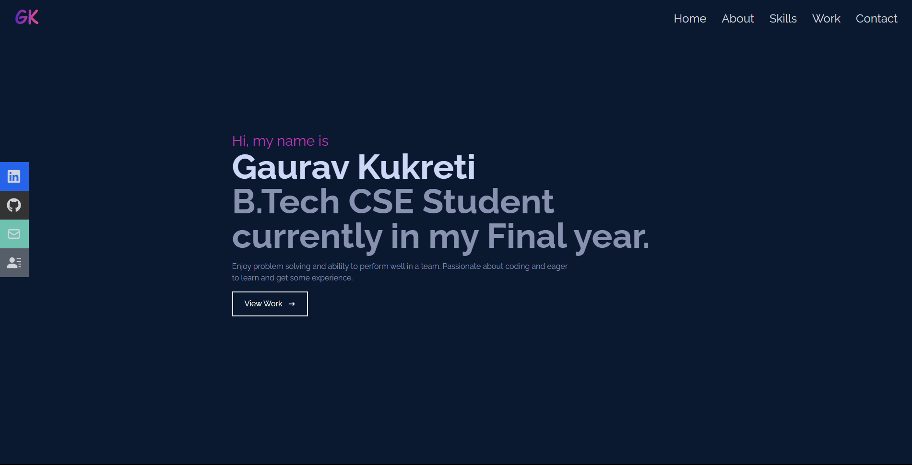

## <strong>"React-Tailwind Portfolio"</strong>

A dynamic and visually appealing portfolio website built using the powerful combination of <b style='color:#0D6D8C'>React</b> and <b style='color:#0D6D8C'>Tailwind CSS</b>. With smooth transitions and responsive layouts, it offers an optimal user experience across various devices. The integration of React allows for easy component-based development, while Tailwind CSS ensures efficient styling and customization.

##

